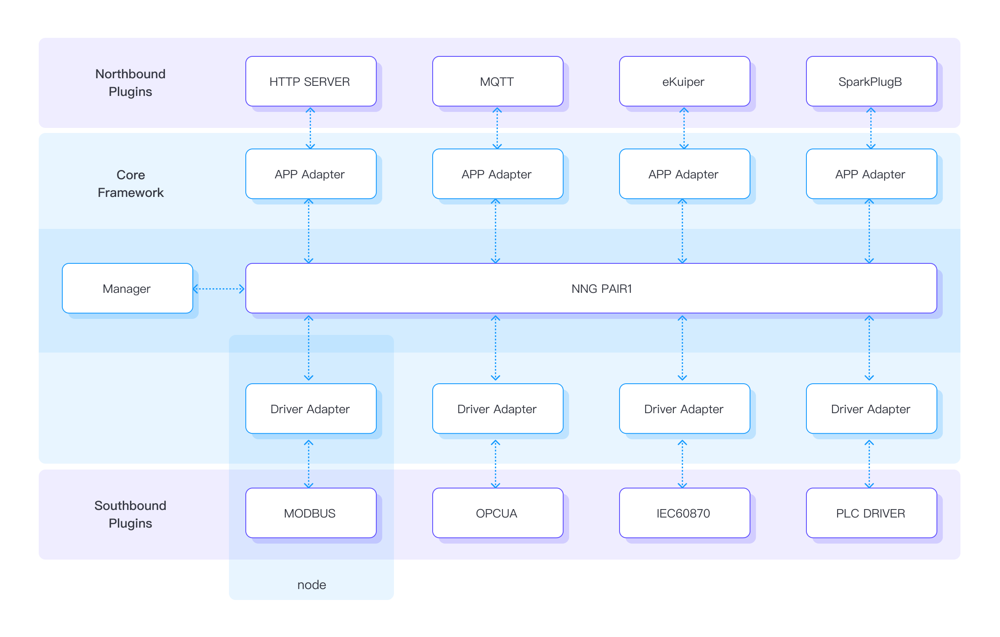

# Configuration

## Configuration Key Concepts
The configuration key concepts are to help understand how to set up the Neuron for various industrial protocol conversions.

### Core
A Neuron core is a framework to provide a foundation to build and adopt various plugins in terms of diverse industrial communication protocols. This core framework includes NNG high-speed bus, a data manager to control data flow, and adapters for plugin integration. 

### Plugin
Neuron can be divided into a core framework and a number of pluggable modules. Pluggable means that these modules can be added and removed dynamically, even supporting hot plugging in the running state. Plugins would be classified into northbound applications and southbound drivers. The northbound plugin is usually used for connecting to a cloud platform, or to an external application like a processing engine. The southbound plugin is a communication driver that implements specific protocols to access external devices. 

All these modules are written in C language and SDK is provided for users who are interested in secondary development. A plugin is just a dynamic linked library (.so) file built by the SDK. At least one northbound plugin and one southbound plugin are required for data delivery and data acquisition respectively to implement the protocol format conversion.

### Adapter
An adapter is a communication routine providing two interfaces for plugin data exchange. On one side, it has a communication interface for NNG high-speed bus that can exchange data messages with other adapters. On the other side, it provides a plugin interface for the integration of a plugin module. This makes two unrelated components, NNG high-speed bus and a plugin, can work together. 

There are two kinds of adapters. A driver adapter is used for integration with a southbound driver plugin. An app adapter is used for integration with a northbound application plugin. An app adapter and a driver adapter are different as they have different logic in handling data message exchange.

### Node
When a plugin is inserted into the core framework, a connection node would be created to communicate with external devices or applications. Node here in Neuron is defined as merging framework interface with communication routines. There may be a lot of nodes created for communication with various parties in a single running instance. It is the core framework to manage the message routing between those nodes. 

A node is simply a combination of an adapter and a plugin module. Message exchange between nodes is based on NNG high-speed bus.

This is a loosely-decoupled designed architecture. All nodes work independently to exchange data with each other, and to communicate with external devices or clouds according to its implemented industrial protocol.

### Tag
A tag is a non-hierarchical unique keyword assigned to a piece of information including data storing location in the device, and data operation properties, which helps describe an item and allows it to be found in the device or processed to be read/written automatically. Users would identify those interested tags in a device to read data from the device or to write data to the device.

### Group
The collection of user-interested tags in a device is divided into several groups to have better management. The routing mechanism is based on these groups as an information unit to be exchanged between nodes. A northbound node can subscribe to any groups in any southbound node. These subscriptions would be used for routing data messages between nodes.

## Configuration Procedures
This procedure is an idea of work flow how to set up he Neuron for various industrial protocol conversions.

### Step 1. Checking over All Available Plugins
Neuron data acquisition and delivery are enabled using various industrial plugins. A specific feature can be used only when corresponding plugin has installed and activated by the License. Since Neuron is a loosely-decoupled architecture, each plugin runs as an independent process thread without interfering each others. 

### Step 2. Creating a Southbound Driver

### Step 3. Adding Groups and Tags to the Driver

### Step 4. Repeating Step 2-3 to Build More Drivers

### Step 5. Creating a Northbound Application

### Step 6. Subscribing the Groups

## Configuration APIs
A set of configuraiton APIs is provided for integrating with industrial IoT platform, MES or other controlling systems.

### Global Configuration API

### Procedural Configuration APIs

