# Integrate with EMQX

This page introduces how to use the Neuron southbound driver to collect data, then report the data to EMQX through the northbound Sparkplug B plug-in, and the correct and complete data results are obtained after decoding through the codec function. The process is shown in the figure:


## Configure Neuron

### Southbound Device

Collect the Modbus TCP simulator point value through the southbound drive to simulate the actual device point value, the configuration is as follows：

**Add device**


**Device Configuration**

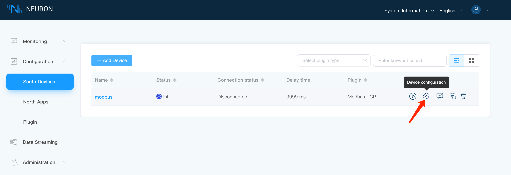

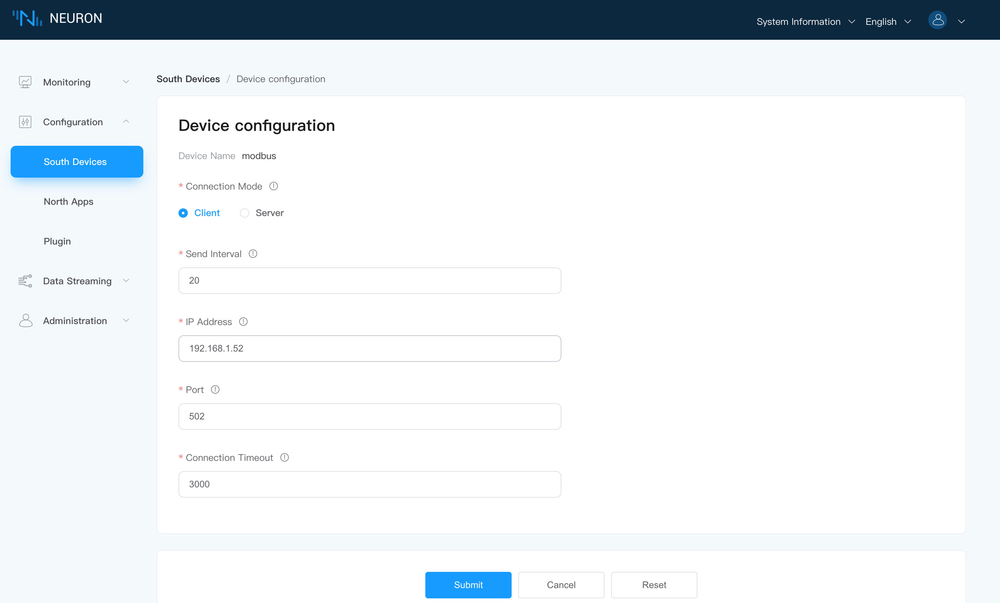

**Create group**


**Create Tag**

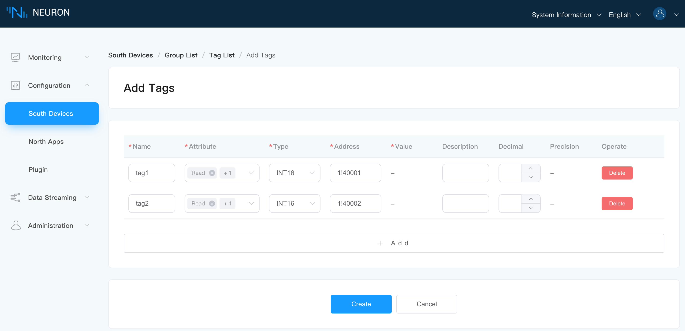

### Northbound Application

**Add application**

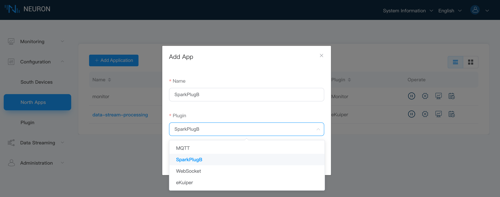

**Application configuration**

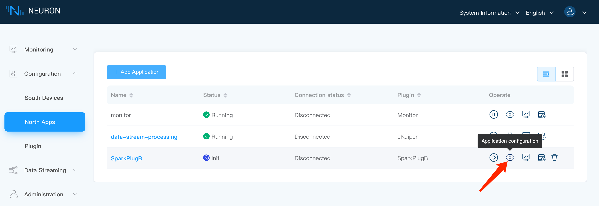

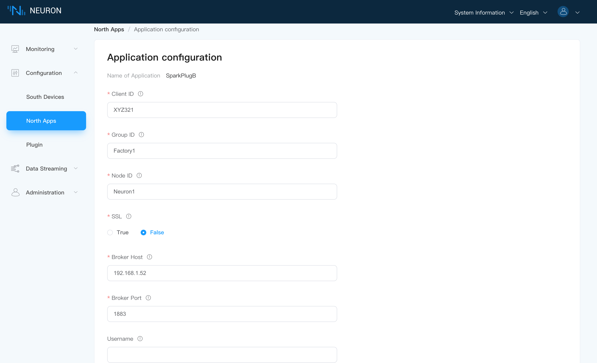

**Add subscription**


## Configure EMQX

You can use [MQTTX](https://mqttx.app/) to view the forwarded messages  to EMQX from Neuron. However, if you directly subscribe to the EMQX data reported by Neuron northbound to SparkPlugB, there will be garbled strings, as shown in the figure:

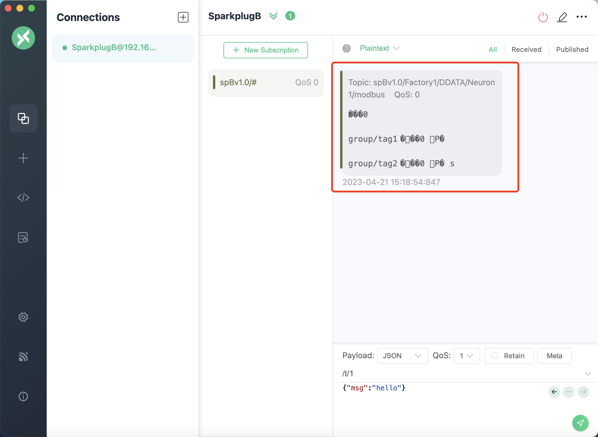

Therefore, through the encoding and decoding capabilities of the EMQX rule engine, a corresponding proto file can be written and combined with the rule engine to decode the reported data and obtain correct and complete data results.

### Create Schema Registry


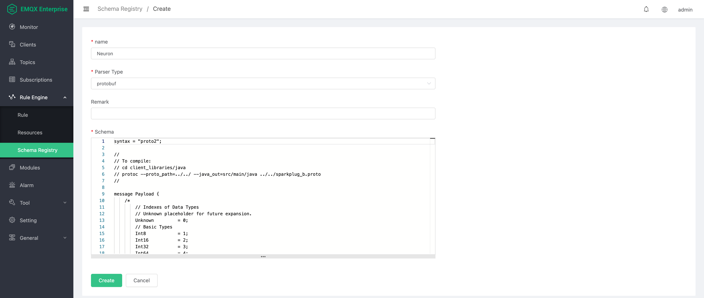

```
// Complete proto file
syntax = "proto2";

//
// To compile:
// cd client_libraries/java
// protoc --proto_path=../../ --java_out=src/main/java ../../sparkplug_b.proto 
//

message Payload {
    /*
        // Indexes of Data Types
        // Unknown placeholder for future expansion.
        Unknown         = 0;
        // Basic Types
        Int8            = 1;
        Int16           = 2;
        Int32           = 3;
        Int64           = 4;
        UInt8           = 5;
        UInt16          = 6;
        UInt32          = 7;
        UInt64          = 8;
        Float           = 9;
        Double          = 10;
        Boolean         = 11;
        String          = 12;
        DateTime        = 13;
        Text            = 14;
        // Additional Metric Types
        UUID            = 15;
        DataSet         = 16;
        Bytes           = 17;
        File            = 18;
        Template        = 19;
        
        // Additional PropertyValue Types
        PropertySet     = 20;
        PropertySetList = 21;
    */

    message Template {
        
        message Parameter {
            optional string name        = 1;
            optional uint32 type        = 2;

            oneof value {
                uint32 int_value        = 3;
                uint64 long_value       = 4;
                float  float_value      = 5;
                double double_value     = 6;
                bool   boolean_value    = 7;
                string string_value     = 8;
                ParameterValueExtension extension_value = 9;
            }

            message ParameterValueExtension {
                extensions              1 to max;
            }
        }

        optional string version         = 1;          // The version of the Template to prevent mismatches
        repeated Metric metrics         = 2;          // Each metric is the name of the metric and the datatype of the member but does not contain a value
        repeated Parameter parameters   = 3;
        optional string template_ref    = 4;          // Reference to a template if this is extending a Template or an instance - must exist if an instance
        optional bool is_definition     = 5;
        extensions                      6 to max;
    }

    message DataSet {

        message DataSetValue {

            oneof value {
                uint32 int_value                        = 1;
                uint64 long_value                       = 2;
                float  float_value                      = 3;
                double double_value                     = 4;
                bool   boolean_value                    = 5;
                string string_value                     = 6;
                DataSetValueExtension extension_value   = 7;
            }

            message DataSetValueExtension {
                extensions  1 to max;
            }
        }

        message Row {
            repeated DataSetValue elements  = 1;
            extensions                      2 to max;   // For third party extensions
        }

        optional uint64   num_of_columns    = 1;
        repeated string   columns           = 2;
        repeated uint32   types             = 3;
        repeated Row      rows              = 4;
        extensions                          5 to max;   // For third party extensions
    }

    message PropertyValue {

        optional uint32     type                    = 1;
        optional bool       is_null                 = 2; 

        oneof value {
            uint32          int_value               = 3;
            uint64          long_value              = 4;
            float           float_value             = 5;
            double          double_value            = 6;
            bool            boolean_value           = 7;
            string          string_value            = 8;
            PropertySet     propertyset_value       = 9;
            PropertySetList propertysets_value      = 10;      // List of Property Values
            PropertyValueExtension extension_value  = 11;
        }

        message PropertyValueExtension {
            extensions                             1 to max;
        }
    }

    message PropertySet {
        repeated string        keys     = 1;         // Names of the properties
        repeated PropertyValue values   = 2;
        extensions                      3 to max;
    }

    message PropertySetList {
        repeated PropertySet propertyset = 1;
        extensions                       2 to max;
    }

    message MetaData {
        // Bytes specific metadata
        optional bool   is_multi_part   = 1;

        // General metadata
        optional string content_type    = 2;        // Content/Media type
        optional uint64 size            = 3;        // File size, String size, Multi-part size, etc
        optional uint64 seq             = 4;        // Sequence number for multi-part messages

        // File metadata
        optional string file_name       = 5;        // File name
        optional string file_type       = 6;        // File type (i.e. xml, json, txt, cpp, etc)
        optional string md5             = 7;        // md5 of data

        // Catchalls and future expansion
        optional string description     = 8;        // Could be anything such as json or xml of custom properties
        extensions                      9 to max;
    }

    message Metric {

        optional string   name          = 1;        // Metric name - should only be included on birth
        optional uint64   alias         = 2;        // Metric alias - tied to name on birth and included in all later DATA messages
        optional uint64   timestamp     = 3;        // Timestamp associated with data acquisition time
        optional uint32   datatype      = 4;        // DataType of the metric/tag value
        optional bool     is_historical = 5;        // If this is historical data and should not update real time tag
        optional bool     is_transient  = 6;        // Tells consuming clients such as MQTT Engine to not store this as a tag
        optional bool     is_null       = 7;        // If this is null - explicitly say so rather than using -1, false, etc for some datatypes.
        optional MetaData metadata      = 8;        // Metadata for the payload
        optional PropertySet properties = 9;

        oneof value {
            uint32   int_value                      = 10;
            uint64   long_value                     = 11;
            float    float_value                    = 12;
            double   double_value                   = 13;
            bool     boolean_value                  = 14;
            string   string_value                   = 15;
            bytes    bytes_value                    = 16;       // Bytes, File
            DataSet  dataset_value                  = 17;
            Template template_value                 = 18;
            MetricValueExtension extension_value    = 19;
        }

        message MetricValueExtension {
            extensions  1 to max;
        }
    }

    optional uint64   timestamp     = 1;        // Timestamp at message sending time
    repeated Metric   metrics       = 2;        // Repeated forever - no limit in Google Protobufs
    optional uint64   seq           = 3;        // Sequence number
    optional string   uuid          = 4;        // UUID to track message type in terms of schema definitions
    optional bytes    body          = 5;        // To optionally bypass the whole definition above
    extensions                      6 to max;   // For third party extensions
}
```

### Create Rule

**SQL statement**

```
SELECT
  schema_decode('neuron', payload, 'Payload') as SparkPlugB
FROM
  "spBv1.0/group1/DDATA/node1/modbus"
```

The key point here is  `schema_decode('neuron', payload, 'Payload')`:

- `schema_decode` The function decodes the content of the payload field according to the Schema 'protobuf_person';
- `as SparkPlugB` Store the decoded value in the variable "SparkPlugB";
- The last parameter `Payload` indicates that the message type in the payload is the 'Payload' type defined in the protobuf schema.

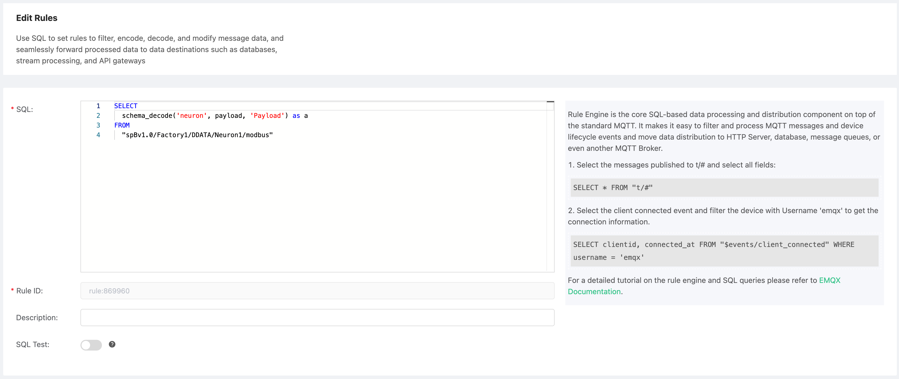

**Then add the action with the following parameters:**

- Action Type: Message republish
- Purpose topic: SparkPlugB/test

This action sends the decoded "Payload" to the `SparkPlugB/test` topic in JSON format.

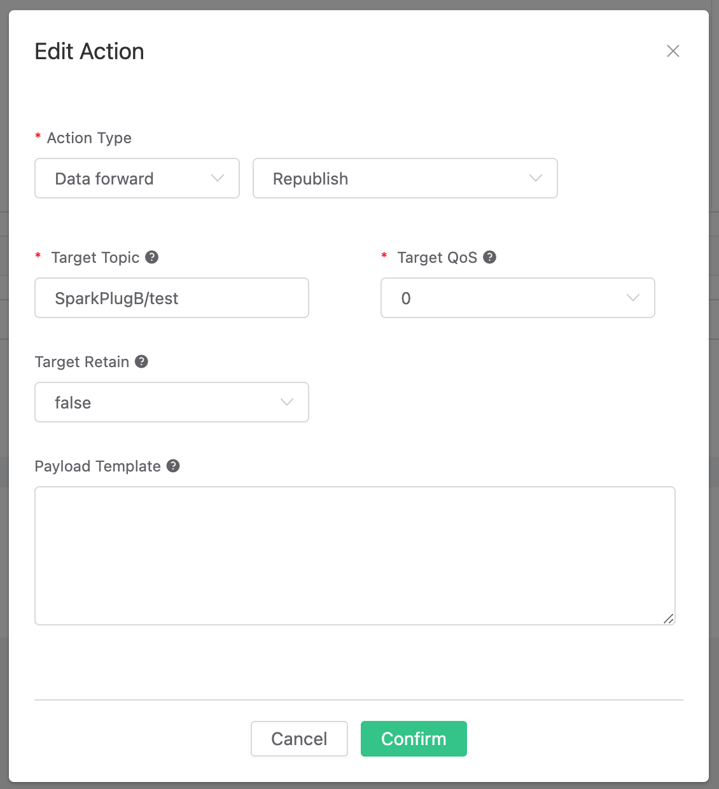

## Verify with MQTTX

Here, the MQTTX tool is used to subscribe to the data decoded by the codec function of the EMQX rule engine, as shown in the figure:

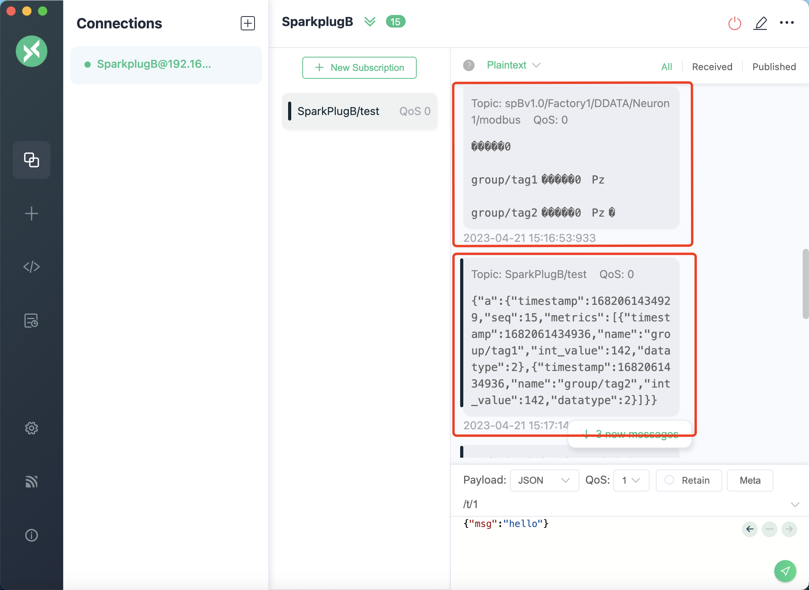

As shown in the figure above, it can be seen that the original data before decoding is garbled, and the complete and correct data result is obtained after decoding; so far, the point value of the device is collected in the south direction of Neuron, and reported to EMQX in the north direction of SparkPlugB, and the complete data is obtained by decoding through the codec function Data results are complete.

## Further Reading

The topic that Neuron reports data to EMQX is `namespace/group_id/DDATA/edge_node_id/device_id` defined according to the Sparkplug B protocol specification, as shown in the figure:

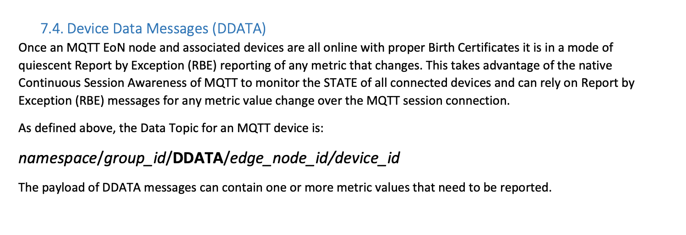

As for how to define more Neuron northbound Sparkplug B plug-in related standards, you can refer to the Sparkplug B protocol specification[🔗](https://www.eclipse.org/tahu/spec/Sparkplug%20Topic%20Namespace%20and%20State%20ManagementV2.2-with%20appendix%20B%20format%20-%20Eclipse.pdf)
