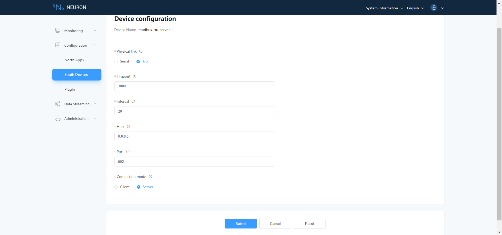
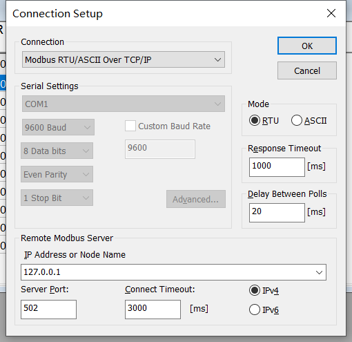

# Modbus Poll Example

## Download And Install Modbus Poll Simulator

Modbus Poll is a Modbus master simulator designed primarily to help developers of Modbus slave devices or others that want to test and simulate the Modbus protocol.

Modbus Poll read/write data from devices using:
* Modbus RTU or ASCII on RS232 or RS485 networks. (USB/RS232/485 Converter)
* Modbus TCP/IP.
* Modbus Over TCP/IP. (Modbus RTU/ASCII encapsulated in a TCP packet)
* Modbus UDP/IP.
* Modbus Over UDP/IP. (Modbus RTU/ASCII encapsulated in a UDP packet)
  
Install Modbus Poll software, and the installation package can be download form [modbus tool download](https://www.modbustools.com/download.html), choose the appropriate version based on the operating environment.The software provides a free usage period of 30 days. For the free duration phase, the connection will be disconnected once every 10 minutes, and after disconnection, the software needs to be restarted.
  
## How To Connect To Neuron As Server?

This section mainly describes the configuration of Neuron and Modbus Poll when Neuron serves as the Server and Modbus Poll serves as the Client.

As a Client, Modbus Poll initiates connection requests to Neuron. Users need to ensure the network connectivity of Modbus Poll -> Neuron. This connection mode can generally be used in the following scenarios. When some device uses 4G to access the Internet, Neuron cannot actively connect to device, so Neuron can only choose Server mode and actively connect to Neuron by device.

### Configure Neuron Southbound Driver Server

In the southbound driver management, using Modbus RTU plugin create a node named modbus-rtu-server, and configure the driver, as shown in the figure below.

* Select TCP as physical link;
* Select server as the connection mode;
* Host, fill in 0.0.0.0;
* Port, fill in the listening port;

### Configure Modbus Poll Client

* After installation, run Modbus Poll.
* Enter **Connection -> Connect**, choose a connection method based on actual circumstances(this example is Modbus RTU/ASCII Over TCP/IP) and set up the connection parameters(the IP address and listening port of the Neuron), clicking **OK** will complete the configuration, as shown in the figure below.

* Enter **Setup -> Read/Write Definition**, or click on toolbar set read/write definition. Setting up address parameters based on the read/write requirements, clicking **ok** will complete configuration.
* The data about read/write definition show on single document interface. If you want to see data for multiple read/write definition, click **File -> New**, create a new document windows, repeat step 3. You can input site number, address, and value to modify data on slave using double-clicking item in table.
* If you need to connect multiple slave devices simultaneously, run Modbus Poll on multiple instances. Repeat the above steps.