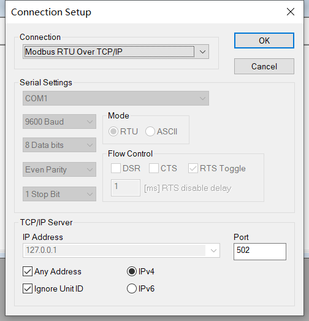
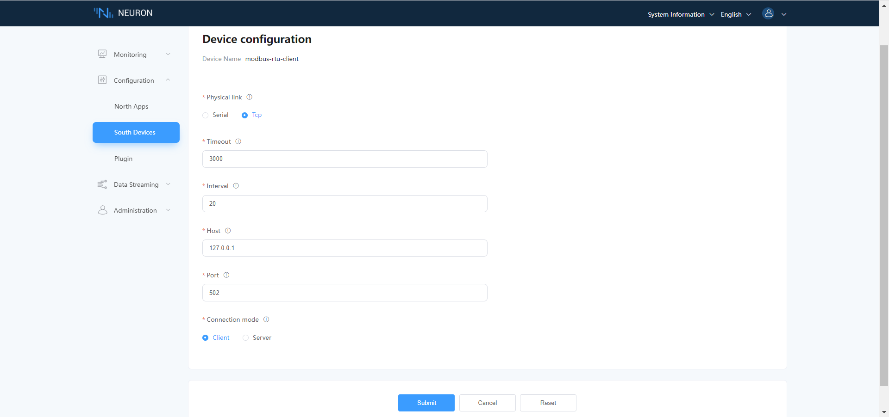

# Modbus Slave

Modbus Slave is a comprehensive simulator designed to accelerate PLC programming and testing. It allows users to begin programming and conducting tests before the arrival of the actual slave device from the supplier. 

Modbus Slave read/write data from devices using:
* Modbus RTU or ASCII on RS232 or RS485 networks (USB/RS232/485 Converter)
* Modbus TCP/IP
* Modbus Over TCP/IP (Modbus RTU/ASCII encapsulated in a TCP packet)
* Modbus UDP/IP
* Modbus Over UDP/IP (Modbus RTU/ASCII encapsulated in a UDP packet)

## Install Modbus Slave Simulator

Install Modbus Slave software and the installation package can be downloaded from [Modbus tool download](https://www.modbustools.com/download.html), choose the appropriate version based on the operating environment. The software provides a free usage period of 30 days. For the free duration phase, the connection will be disconnected once every 10 minutes, and after disconnection, the software needs to be restarted.

## Connect Neuron (Client)

This section mainly describes the configuration of Neuron and Modbus Slave when Neuron serves as Client and Modbus Slave serves as Server.

As a Client, Neuron initiates connection requests to Modbus Slave actively. The user needs to ensure the network connectivity of Neuron -> Modbus Slave.

### Configure Modbus Slave

1. After installation, run Modbus Slave.
2. Enter **Connection -> Connect**, choose a connection method based on actual circumstances(this example is Modbus RTU Over TCP/IP), and set up the connection parameters (listening port), clicking **OK** will complete the configuration, as shown in the figure below.

3. Enter **Setup -> Slave Definition**, or click on toolbar set slave definition. Setting up address parameters based on the read/write requirements, and clicking **ok** will complete configuration.

4. Information regarding the slave definition is displayed within a single document interface. To view data for multiple slave definitions, navigate to **File -> New**. This action will generate a new document window; then, repeat step 3. You can alter the data by double-clicking on any item within the table, which will allow you to input a new value.
5. If you need to simulate multiple slave devices simultaneously, run Modbus Slave on multiple instances. Repeat the above steps.

### Configure Neuron (Client)

In **South Devices**, using Modbus RTU plugin to create a node named modbus-rtu-client, and configure the driver, as shown in the figure below.

* Select TCP as **Physical link**;
* **Connection mode**: select **Client**.
* **Host**: Fill in the IP address of Modbus Slave.
* **Port**: Fill in the port of Modbus Slave.