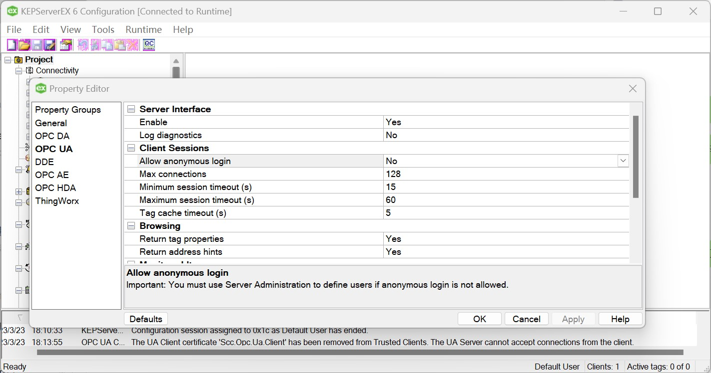
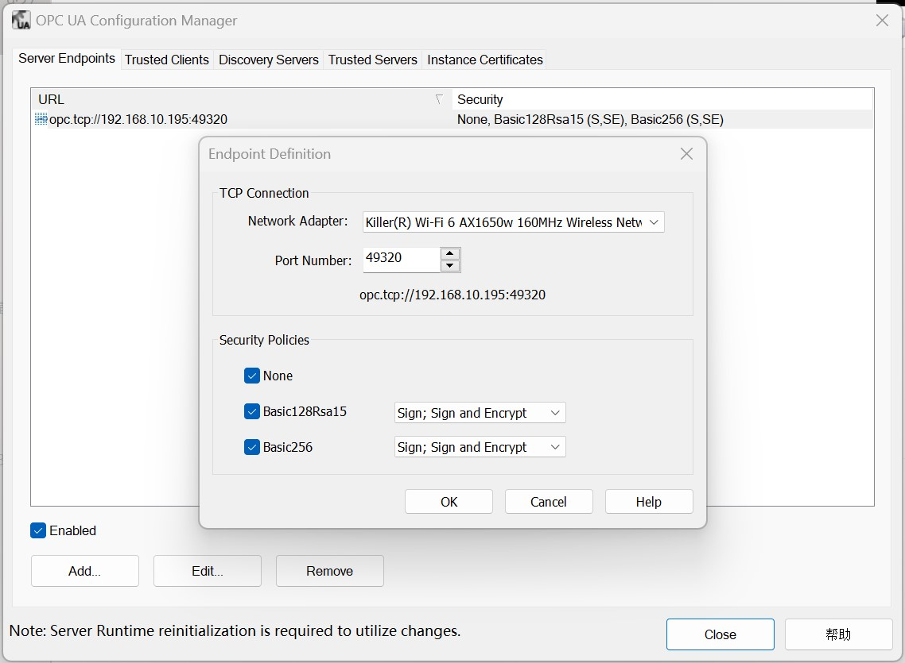
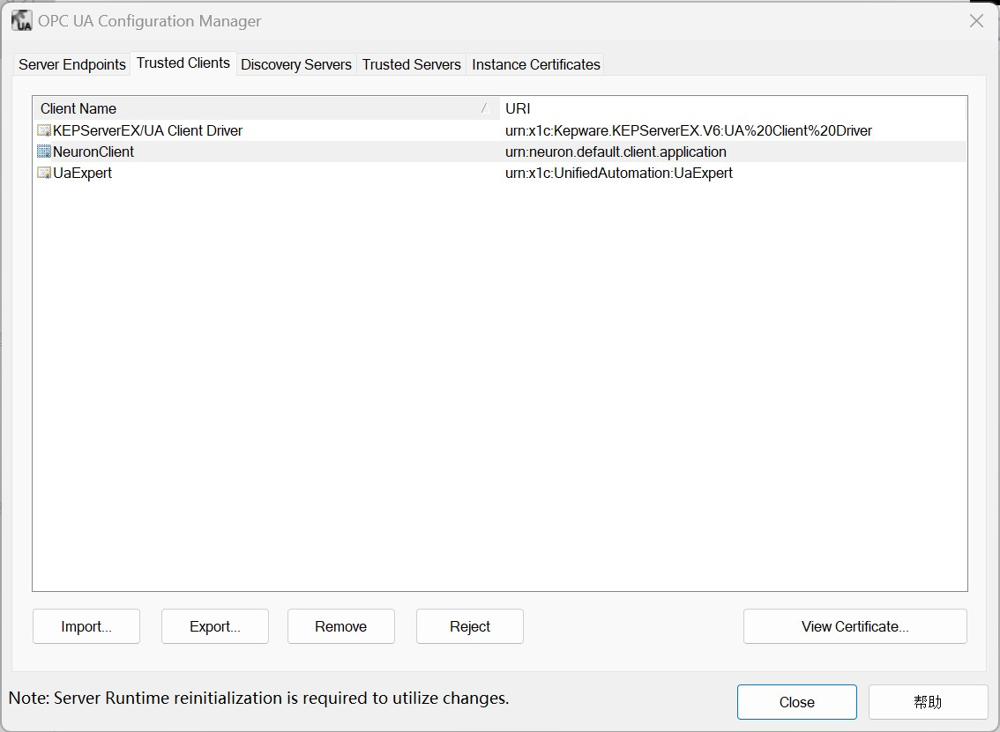

# Connect to KEPServerEX

## Username/Password Login

1. Right-click on the KEPServerEX icon in the system tray, select **Settings** -> **KEPServerEX Settings** -> **User Manager**, create a new user under the `Administrators` group and set the Username/Password.

2. Double click on the KEPServerEX icon in the system tray, open the **Project** -> **Property Editor** -> **OPC UA**, and set `Allow anonymous login` to `No`.

3. Right-click on the KEPServerEX icon in the system tray, select **OPC UA Configuration** -> **Server Endpoints**, double-click on the endpoint entry and check all security policies.

4. Right-click on the KEPServerEX icon in the system tray and select **Reinitialize** in the menu.

5. Neuron adds a new southbound OPC UA device, opens **Device Configuration**, fills in the `Endpoint URL` of the target Server, fills in the user name/password, no need to add certificate/key, and starts the device connection.

6. Right-click on the KEPServerEX icon in the system tray, select **OPC UA Configuration** -> **Trusted Clients**, and set the NeuronClient certificate as trusted.

7. Right-click on the KEPServerEX icon in the system tray and select **Reinitialize** in the menu.

## Certificate/key + username/password login

1. Set the username/password as above.

2. Refer to [Connection policy](./policy.md) to generate or convert a certificate/key.

3. Right-click on the KEPServerEX icon in the system tray, select **OPC UA Configuration** -> **Trusted Clients**, and import the client certificate in DER format into the list.

4. Right-click on the KEPServerEX icon in the system tray and select **Reinitialize** in the menu.

## Neuron setting

1. To view the PLC measurement point information via the UaExpert software, Refer to [UaExpert usage](./uaexpert.md).

2. Neuron adds a new southbound OPC UA device, opens **Device Configuration**, fills in the `Endpoint URL` of the target Server, fills in the user name/password, adds the certificate/key, and starts the device connection.

3. Add `Groups` and `Tags` based on the measurement point information.

## Test Data List

|  Name    |  Address                                      | Attribute       | Data type   |
| -------- | ------------------------------------------ | ---------- | ------ |
| BuildDate | 0!2266 | Read | UINT32 |
| BuildNumber | 0!2265 | Read | STRING |
| ManufacturerName | 0!2263 | Read | STRING |
| ProductName | 0!2261 | Read | STRING |
| ProductUri | 0!2262 | Read | STRING |
| SoftwareVersion | 0!2264 | Read | STRING |

