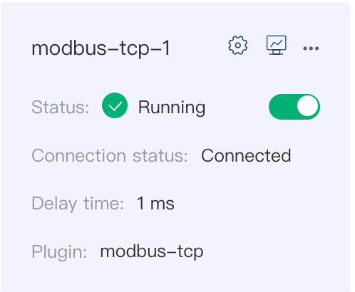

# Connect To Southbound Devices

## Step 1, Add A Southbound Device

Create a southbound device node to connect to a real device or simulator.

Select **South Devices -> Configuration** menu to enter the southbound device management interface, and click `Add Device` to add deivce nodes and add a new southbound device:

* Name: fill in the name of the device, such as modbus-tcp-1;
* Plugin: select the plugin of modbus-tcp from the drop-down box.

## Step 2, Setting Southbound Device's Parameters

Configure the parameters required for Neuron to establish a connection with the device. In the upper right corner, you can select a list or card to display southward equipment

Click the `Device Configuration` button on the southbound device card to enter the device configuration interface:

* Device IP Address: fill in the IP of the PC where PeakHMI Slave Simulators software is installed;
* Device Port: fill in the port used by the simulator. Port 502 is used by default;
* Recv Timeout: The unit is ms, and the default is 3,000. If no message is received after the set time, an error will be reported;
* Click `Submit` to complete the equipment configuration, and the equipment card will automatically enter the working state of **Running**.

:::tip
The configuration parameters required by each device are different. Please refer to [Southbound Drivers](../south-devices/modbus-tcp/modbus-tcp.md) for detailed description of southbound device parameters.
:::

After the southbound device/northbound application is successfully created, a newly created card will appear in the southbound/northbound management interface, as shown in the following figure.

This device card contains the following information:

* Name: the unique name provided by the user for the southbound equipment/northbound application. After setting, the name cannot be modified temporarily.
* Device/application configuration: Click this button to enter the configuration interface, which is used to set the parameter settings required for connecting Neuron with southbound devices/northbound applications.
* Data statistics：statistics node card information.
* More
    * DEBUG log: print the node debug log, and restore the default log level after ten minutes.
    * Delete: delete this node from the list of southbound devices.
* Status: displays the current status of the equipment node and five working statuses.
    * **Init**: after the southbound device/northbound application card is added for the first time, it will enter the initialization state.
    * **Setup**: enter the device/application configuration and enter the configuration state.
    * **Ready**: after successful configuration, enter the ready state.
    * **Running**：running device card.
* Working state switch button: open to connect to the device.
    * Open, Neuron establishes connection with equipment/application, and begins to collect data.
    * Close, disconnect, stop collecting data.
* Connection Status: displays the connection status of the device.
    :::tip
    After adding group and tag, Neuron will connect the device to collect data, and the connection status will show **Connected**.
    :::
* Delay time: the time interval between sending and receiving an instruction.
* Plugin: Used to display the name of the plugin module used by this device.

