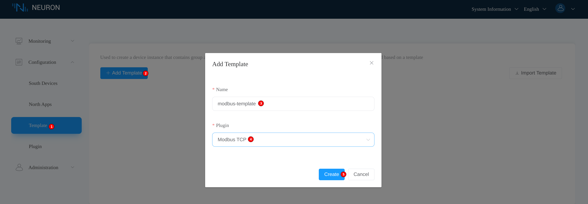
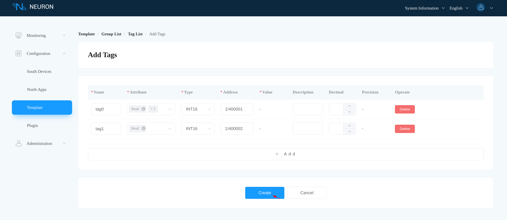
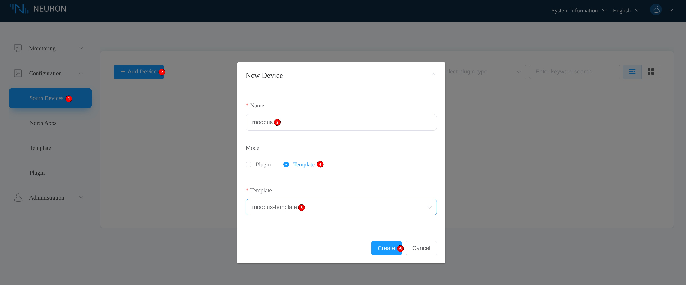
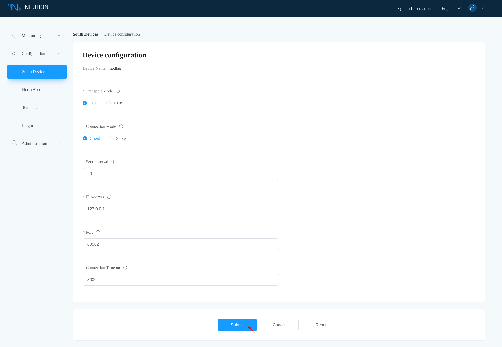
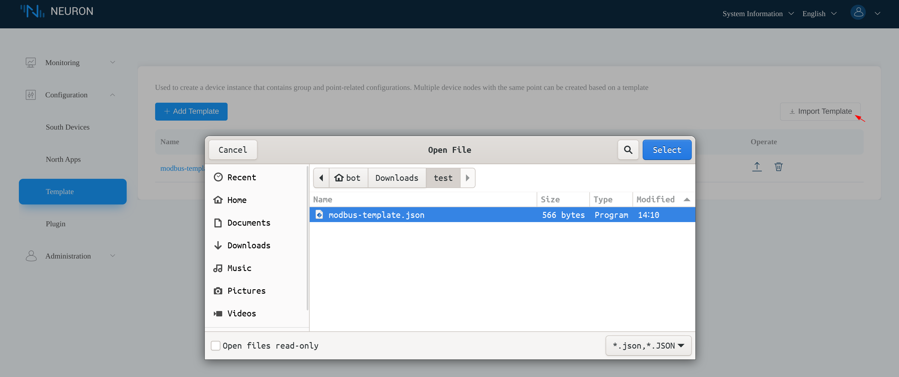

# Templates

In practice, Neuron users often need to create large numbers of nodes having
similar configurations. This can be a time-consuming and error-prone process,
especially in large-scale deployments. To streamline this process, Neuron
introduces the template feature in version **2.5.0**.

The Neuron template feature allows users to create a template with the desired
plugin and configurations including groups and tags. Users could then use that
template as a basis to create new nodes.
By using templates, users can quickly and easily create new nodes with similar
configurations, saving time and effort.

::: tip
Neuron 2.5.0 template feature only supports south bound plugins.
:::

## How to create a template

### Add template

Click **Configuration -> Template -> Add Template** to open the
**Add Template** dialog.

  

Fill in the template name and select the desired plugin, then click the
**Create** button. If everything is successful, you should see the created
template in the **Template** tab.

  

### Add template group

At this point, the created template is empty without any data.
Click the created template to enter the **Group List** page.

  

To add a group to the template, it is pretty much the same as that in
[Configure Data Groups And Tags](../groups-tags/groups-tags).
Here, we add a group named *grp* with an interval of *3000*.

  

### Add template tag

Click the created *grp* group to enter the **Tag List** page.

  

Click the **Create** button to enter the **Add Tags** page.

  

To keep things simple, we just add two tags.
Click the **Create** button to finally submit the tags as shown in the
**Tag List** page.

  

## How to instantiate a template

Click **Configuration -> South Devices -> Add Device** to open the
**New Device** dialog.

  

Fill in the south device name, then select **Template** mode and the template
to instantiate from. Click the **Create** button to bring up the
**Device configuration** page.

  

Fill in the settings and click **Submit**. If no errors, a new south device
should be listed in the **South Devices** tab.

  

Click the instantiated south device to enter the **Group List** page.
Clearly, the instantiated south device has a group named *grp* with interval
*3000*, which is the same as that of the selected template.

  

Click the *grp* group to enter the **Tag List** page. Also not surprisingly, there
are two tags, which are the same as that of the template.

  

## How to export/import templates

### Export template

To export a template, just click the **Export icon** on the desired template
and it will export the template data to a JSON file.

  

### Import template

To import a template, click **Import Template** in the **Template** tab
and provide the JSON file to import data from.

  

In the **Import Template** dialog, users could alter the template name to avoid
name conflicts. Click the **Create** button to finish the import.

  

Imported templates are shown as usual in the **Template** tab.

  
