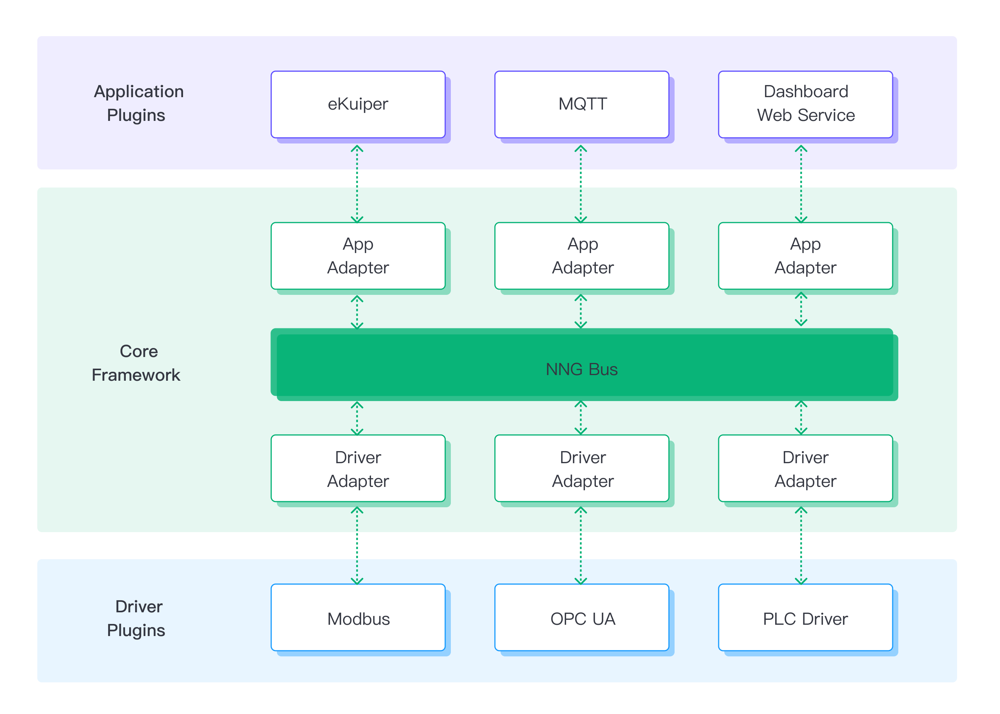
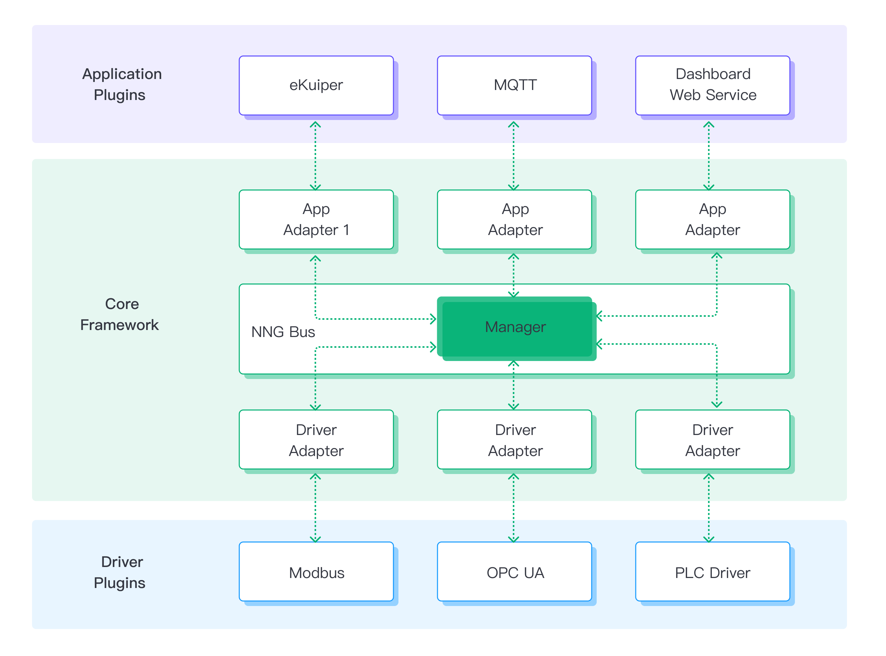
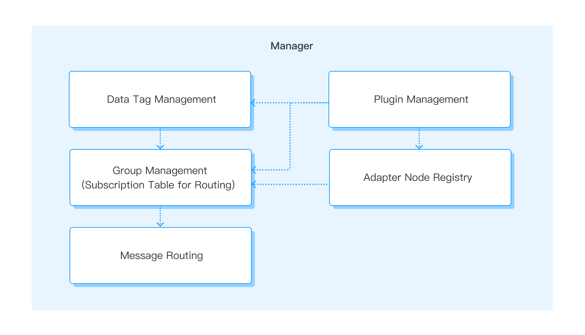

# Architecture

Neuron is a software solution specifically designed for the Industrial Internet of Things (IIoT) platform. It operates at the edge, where data collection, forwarding, distribution, and aggregation tasks are efficiently managed. With a focus on ultra-low latency processing, Neuron ensures rapid and effective handling of diverse data originating from multiple sources.

## Nanomsg-Next-Generation (NNG) Messaging Library

Neuron leverages the lightweight NNG Messaging Library to construct a message bus, establishing a reliable and efficient messaging infrastructure for inter-node communications. A node is a combination of an adapter and a plugin.

NNG offers in-process (inter-thread) communication between different nodes. It abstracts the complexities of low-level pipeline and provides a simplified interface for sending and receiving messages.

NNG also supports high message rates and large-scale systems by employing techniques like efficient message queuing, load balancing, and dynamic discovery of peers to ensure scalability and fault tolerance.

NNG provides a convenient and efficient messaging framework for building distributed and scalable application.

## Message Framework Topology

Neuron's core message bus is built upon the pairs-1 feature of the nanomsg library. It follows a star-like scalable framework, where a central message routing core is surrounded by two types of adapters.

In this architecture, the southbound driver nodes serve as data producers responsible for communication with devices. They establish connections and gather data from the devices, acting as the initial source of data within the system.

Conversely, the northbound application nodes act as data consumers. They receive data messages from the message routing core and perform tasks such as processing or forwarding the received data. These nodes handle the data in a way that aligns with the system's requirements or logic.

The message routing core (manager) plays a central role in the Neuron framework. It acts as a hub, receiving data messages from the southbound driver nodes and efficiently routing them to the appropriate northbound application nodes for further handling.

## Routing Core Services

The message routing core (manager) plays a crucial role in overseeing the message bus and the two types of adapters.

<b>Data tag management:</b> The Manager module is responsible for maintaining configurations of data tags for all nodes within the system. These data tags consist of addresses and attributes that describe the data in devices or PLCs. The Manager ensures that these configurations are up-to-date and accessible for efficient data processing.

<b>Plugin management:</b> Users have the flexibility to dynamically load or unload dynamic .so files (shared object files) at any time. The Manager module facilitates this capability and allows users to register these files as alternative plugins in the plugins table. This way, users can extend the functionality of the system by adding or removing plugins as needed.

<b>Adapter management:</b> The Manager module enables users to select the required plugins based on their desired functionality and the services provided by the plugins, as outlined in the plugin table. By managing the adapters, the Manager ensures that the appropriate plugins are utilized for data communication and processing between the nodes.

<b>Group management:</b> When a group of data tags is created, users have the option to subscribe to this group. This subscription triggers the creation of a subscription table for routing purposes. The Manager module utilizes this subscription table to route the data messages to the subscribed nodes, ensuring that the data is delivered to the relevant recipients within the group.

<b>Message routing:</b> A critical task performed by the Manager module is the routing of incoming data messages to the appropriate end nodes based on the data tag configurations. It leverages the information within the data tags to determine the destination nodes for each message, ensuring that the data is directed to the intended recipients effectively.

## Efficient Multi-thread Management

Neuron adopts an edge-native design optimized for modern CPUs' multi-core architecture, including ARM and RISC-V embedded systems. Communication between nodes relies on NNG high-efficiency asynchronous I/O to make good use of multi-core CPU capability. 

At the core of Neuron's efficiency lies our adept multi-thread management, which enables Neuron to deliver real-time performance and execute tasks concurrently within specific time constraints. Inter-thread communication is achieved through the NNG library, offering optimized asynchronous I/O processing for rapid and reliable data message exchange between threads. NNG offers the following features.

* Asynchronous I/O - Neuron utilizes the NNG library's optimized asynchronous I/O framework for swift data processing.
* SMP & Multi-threading - Scale out easily to engage multiple cores in the modern SMP system.
* Brokerless - With lightweight deployment and easy integration into components, Neuron enables seamless incorporation into various systems.

## Loosely-coupled Design

Neuron's nodes function as loosely-coupled threading services, enabling the dynamic creation or removal of nodes without impacting other running nodes, with the exception of the built-in web server node. This flexible design supports real-time loading and unloading of plugin modules, similar to a "hot-plugin" mechanism. It facilitates the seamless addition or upgrade of plugin modules, thereby expanding the application's feature set.

Here is some advantages for plugin mechanism using loosely-coupled desgin:

* Plug-ins rely on adapters as carriers to form nodes.
* Users can dynamically load plug-ins based on functional requirements.
* Loading different plug-ins onto adapters results in nodes with varying functionalities.
* Each node operates independently, allowing for individual plug-in upgrades without affecting others.
* Nodes can be dynamically added by loading modules.

## Data Type Convertion

Within Neuron, various service nodes offer application or driver services, each capable of handling different types of data. Due to the significant variations in data types across these service nodes, it becomes crucial to have a unified data type for efficient data transit.

To achieve this, for example, the Modbus data types can be converted into the Neuron Unified Data Type within the service node. This conversion involves defining the supported data types outlined in the Modbus protocol specification. Subsequently, the Neuron Unified Data Type is further converted into the JSON data type for message transmission to other applications. This process ensures a consistent and compatible data format throughout the system.

## Concurrent Flow Processing

Neuron implements concurrent flow processing, making it well-suited for handling asynchronous I/O operations. This approach enables messages to be processed concurrently by sending them to the desired nodes simultaneously, utilizing a parallel thread pool. To optimize this processing, southbound driver nodes (data producers) are advised to organize data streams into groups. In turn, northbound application nodes (data consumers) can subscribe to specific data stream groups from different nodes based on their requirements. This mechanism allows for efficient and flexible data flow within the system, enhancing overall performance and scalability.

