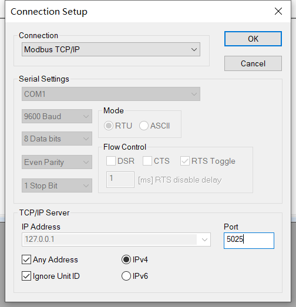
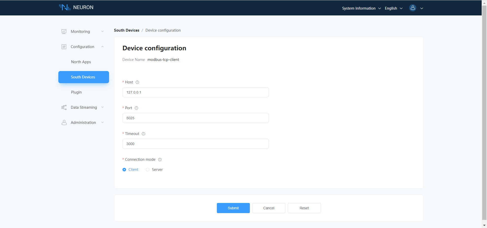

# Modbus Slave Example

## Download And Install Modbus Slave Simulator

Modbus Slave is a Modbus slave simulator. Speed up your PLC programming with this simulating tools. Start programming and test before you receive your slave device from supplier.

Modbus Slave read/write data from devices using:
* Modbus RTU or ASCII on RS232 or RS485 networks. (USB/RS232/485 Converter)
* Modbus TCP/IP
* Modbus Over TCP/IP. (Modbus RTU/ASCII encapsulated in a TCP packet)
* Modbus UDP/IP
* Modbus Over UDP/IP. (Modbus RTU/ASCII encapsulated in a UDP packet)

Install Modbus Slave software, and the installation package can be download form [modbus tool download](https://www.modbustools.com/download.html), choose the appropriate version based on the operating environment.The software provides a free usage period of 30 days. For the free duration phase, the connection will be disconnected once every 10 minutes, and after disconnection, the software needs to be restarted.

## How To Connect To Neuron As Client?

This section mainly describes the configuration of Neuron and Modbus Slave when Neuron serves as Client and Modbus Slave serves as Server.

As a Client, Neuron initiates connection requests to Modbus Slave actively. The user needs to ensure the network connectivity of Neuron -> Modbus Slave.

### Configure Modbus Slave

* After installation, run Modbus Slave.
* Enter **Connection -> Connect**, choose a connection method based on actual circumstances(this example is Modbus TCP/IP) and set up the connection parameters(listening port), clicking **OK** will complete the configuration, as shown in the figure below.

* Enter **Setup -> Slave Definition**, or click on toolbar set slave definition. Setting up address parameters based on the read/write requirements, clicking **ok** will complete configuration.
* The data about slave definition show on single document interface. If you want to see data for multiple slave definition, click **File -> New**, create a new document windows, repeat step 3. You can input value to modify data using double-clicking item in table.
* If you need to simulate multiple slave devices simultaneously, run Modbus Slave on multiple instances. Repeat the above steps.

### Configure Neuron Southbound Driver Client

In the southbound driver management, create a node whose plugin is modbus-rtu-client, and configure the driver, as shown in the figure below.

* Connection mode selection client;
* Host fill in the IP address of Modbus Slave;
* Port fill in the port of Modbus Slave configuration;