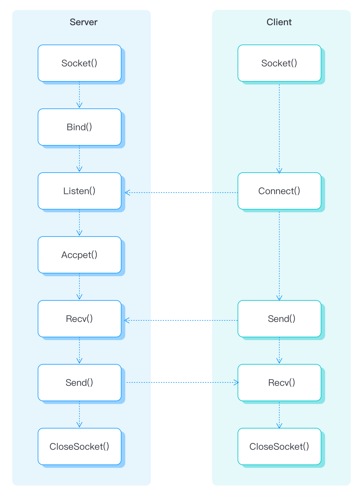
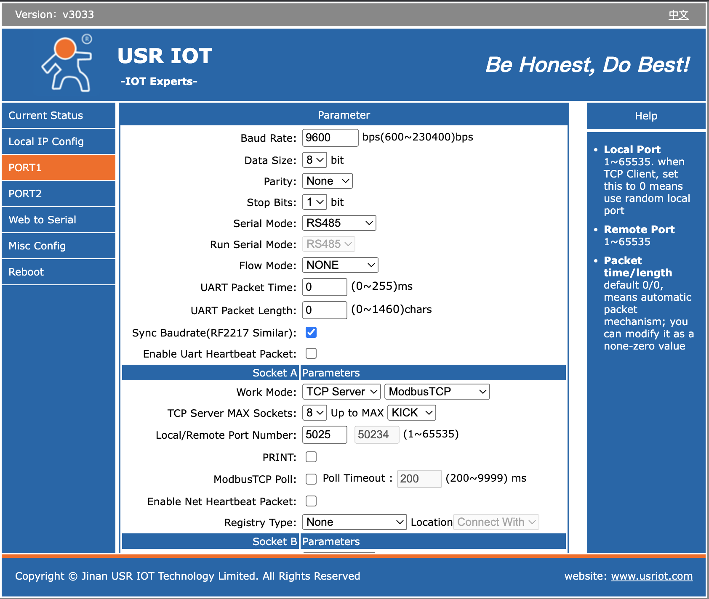
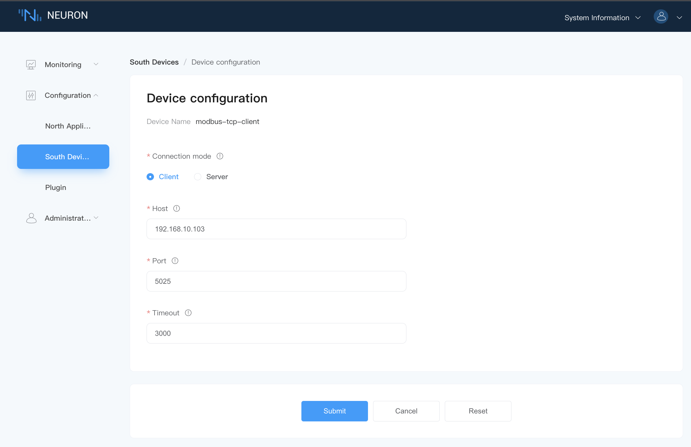
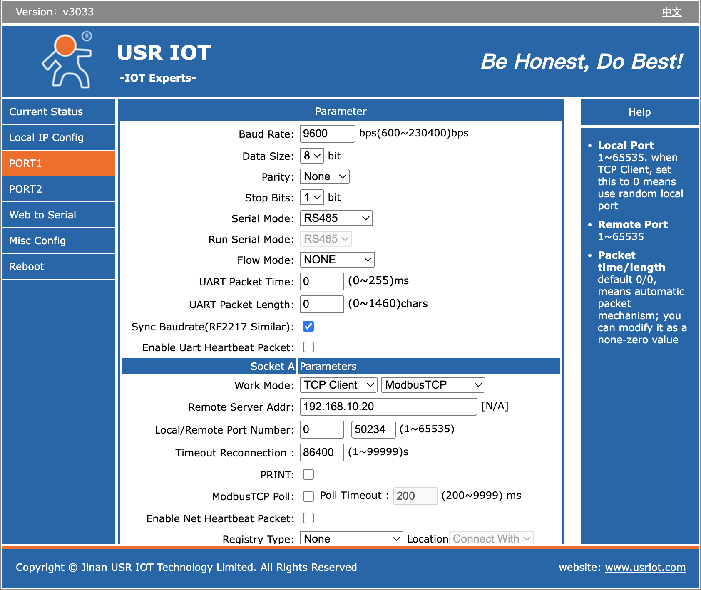

# DTU Connection Example

This article takes the example of using a Modbus RTU protocol device connected to Neuron via the Cloud-Usr DTU transparent transmission module, to illustrate how to convert serial port data into network data. The connection diagram is shown in the following figure.


:::tip
Although Modbus RTU is converted for network transmission, it still uses the Modbus RTU message format. If the DTU converts Modbus RTU to Modbus TCP, a Modbus TCP driver module is required.
:::

DTU supports two-way conversion of data, supports mutual conversion of common serial data such as RS232, RS485, RS422 and TCP/IP data, and transmits them through the wireless communication network. The communication methods generally used by DTU are 2/3/4G, NB-IoT, LoRaWAN, WIFI, etc.

## What Is Client/server Mode?

Client/Server, also known as client/server mode, referred to as C/S mode, is a network communication architecture, which is used to distinguish the two parties who establish a communication connection as a client (Clent) and a server (Server).

In TCP, the client is the initiator of the request and sends the connection request to the server actively, while the server waits for the request from the client passively.

The following figure shows the workflow for establishing a connection between Client and Server.



## How To Connect To Neuron As A Client?

This section mainly describes the configuration of Neuron and DTU when Neuron serves as Client and DTU serves as Server.

As a Client, Neuron initiates connection requests to DTU actively. The user needs to ensure the network connectivity of Neuron -> DTU.

### Configure DTU Server

First, you need to configure the parameters of the connection between the DTU and the serial port, and second, you need to configure the parameters of the Socket for the connection between the DTU and the Neuron, as shown in the figure below.


* Working mode, TCP Server, Modbus TCP;
* Fill in the unused local port, no need to fill in the remote port;
* The following parameters are optional.

:::tip
When the working mode of DTU is Modbus TCP, since DTU converts the modbus rtu serial port protocol to modbus tcp protocol, the modbus-plus-tcp driver in Neuron should be used.

When the working mode of DTU is pass-through mode, the modbus-rtu driver in Neuron should be used at this time.
:::

### Check DTU IP

When configuring the Neuron southbound driver, it needs to be the IP of the DTU on the server side, as shown in the figure below.


### Configure Neuron Southbound Driver Client

In the southbound driver management, create a node whose plugin is modbus-plus-tcp, and configure the driver, as shown in the figure below.


* Connection mode selection client;
* Host fill in the IP address of DTU;
* Port fill in the port of DTU configuration;

## How To Connect To Neuron As Server?

This section mainly describes the configuration of Neuron and DTU when Neuron serves as the Server and DTU serves as the Client.

As a Client, DTU initiates connection requests to Neuron. Users need to ensure the network connectivity of DTU -> Neuron. This connection mode can generally be used in the following scenarios. When some DTU uses 4G to access the Internet, Neuron cannot actively connect to DTU, so Neuron can only choose Server mode and actively connect to Neuron by DTU.

### Configure DTU Client

First, you need to configure the parameters of the connection between the DTU and the serial port, and second, you need to configure the parameters of the Socket for the connection between the DTU and the Neuron, as shown in the figure below.


* Remote server address, fill in the IP address of Neuron running as the server;
* Local port, not filled in by default;
* Remote port, since each TCP Server port will listen to the incoming TCP traffic on the port specified by the client, therefore, the user needs to customize an unoccupied port for handshake establishment between the client and the server connect.

:::tip
You can execute the following command on the server terminal to determine whether the listening port is occupied.

```bash
# Confirm whether the port is occupied
$ netstat -anp |grep <port>
```
:::

### Configure Neuron Southbound Driver Server

In the southbound driver management, create a node whose plugin is modbus-plus-tcp, and configure the driver, as shown in the figure below.


* Select server as the connection mode;
* Host, fill in 0.0.0.0;
* Port, fill in the listening port;

## Supplementary Instructions

When Neuron and DTU are not in the same LAN, you can map the LAN IP and port of the Neuron operating environment to the WAN, and use Neuron as the server end and DTU as the client end. The configuration method is the same as above.
