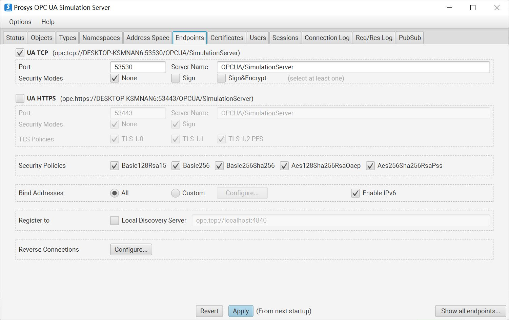

# Connect to Prosys Simulation Server

## Anonymous login

1. Switch to the Endpoints tab in the Prosys OPC UA Simulation Server interface, deselect Sign and Sign&Encrypt for Security Modes, and select None.

2. Switch to the Users tab in the Prosys OPC UA Simulation Server interface, deselect Username&Password, Certificate and IssuedToken/External System, and select Anonymous;

3. Neuron adds a new southbound OPC UA device, opens "Device Configuration", fills in the "Endpoint URL" of the target Server, without filling in username/password, without adding certificate/key, and starts the device connection;

## Certificate/Key + Anonymous Login

1. Refer to [parameter example](./example.md) to generate or convert a certificate/key;

2. Switch to the Endpoints tab in the Prosys OPC UA Simulation Server interface, deselect None for Security Modes, and select Sign and Sign&Encrypt;

3. Switch to the Users tab in the Prosys OPC UA Simulation Server interface, deselect Username&Password, Certificate and IssuedToken/External System, and select Anonymous;

4. Neuron adds a new southbound OPC UA device, opens "Device Configuration", fills in the "Endpoint URL" of the target Server, does not need to fill in the username/password, adds the certificate/key and starts the device connection;

5. Switch to the Certificates tab in the Prosys OPC UA Simulation Server interface and set the client certificate in the list to Trust;

## Username/Password Login

1. Switch to the Endpoints tab in the Prosys OPC UA Simulation Server interface, deselect None for Security Modes, and select Sign and Sign&Encrypt.

2. Switch to the Users tab in the Prosys OPC UA Simulation Server interface, deselect Anonymous, Certificate and IssuedToken/External System for User Authentication Methods, and select Username&Password to add a custom username/password.

3. Neuron adds a new southbound OPC UA device, opens "Device Configuration", fills in the "Endpoint URL" of the target Server, fills in the user name/password, no need to add certificate/key, and starts the device connection.

4. Switch to the Certificates tab in the Prosys OPC UA Simulation Server interface and set the client certificate in the list to Trust.

## Certificate/key + username/password login

1. Same username/password settings as above;

2. Neuron adds a new southbound OPC UA device, opens "Device Configuration", fills in the "Endpoint URL" of the target Server, fills in the user name/password, adds the certificate/key, and starts the device connection;

3. Switch to the Certificates tab in the Prosys OPC UA Simulation Server interface and set the client certificate in the list to Trust;

## Test data list

|  Name    |  Address  | Attribute | Data type   |
| -------- | ------ | ---- | ------ |
| Counter  | 3!1001 | Read | INT32  |
| Random   | 3!1002 | Read | DOUBLE |
| Sawtooth | 3!1003 | Read | DOUBLE |
| Sinusoid | 3!1004 | Read | DOUBLE |
| Square   | 3!1005 | Read | DOUBLE |
| Triangle | 3!1006 | Read | DOUBLE |

