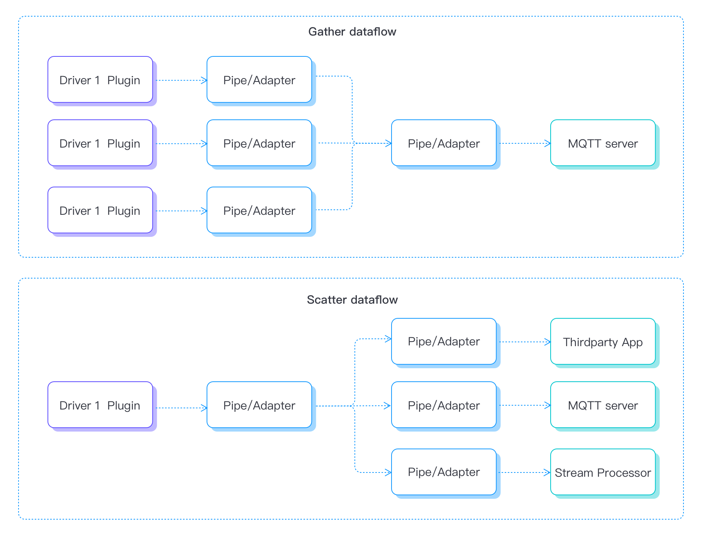

# 了解架构

现代 CPU 在设计上都是多核的，即使是嵌入式系统的低端 ARM 和 RISC-V。多核已经是一种标准。Neuron 必须有一个非常好的多线程管理，以利用现代 CPU 的多核架构的优势。作为一个边缘的本地应用程序，Neuron 必须具有实时特性，在一定的时间范围内执行任务，就像在并发状态下运行一样。因此，我们使用 NNG 作为线程间消息交换的基础库，因为 NNG 为数据消息的传递提供了优化的异步 I/O 处理。

NNG 提供了以下功能。
* 异步 I/O - 建立在优化的 NNG 的异步 I/O 框架上。
* SMP 和多线程 - 在现代 SMP 系统中轻松扩展到多个核心。
* Brokerless - 易于集成到组件中，轻量级部署 

## 概述
核心的消息总线是基于 NNG 库的 pair-1 特性来组织一个星形的可扩展框架。在中心有一个消息路由器核心。外面有两类节点围绕着路由器核心。南向驱动节点是与设备通信的节点，它是一个数据生产者。北向应用节点是数据消费者，处理或转发数据信息。每个节点（南向或北向）都由插件适配器和插件模块组成。节点之间的通信依靠 NNG 高效的异步 I/O 来充分利用多核 CPU 的能力。

## Scatter and Gather
Scatter-Gather 是异步 I/O 处理的一个更好的选择，因为消息需要并发处理，即通过一个并行的线程池在同一时间将消息发送到所需的节点。因此，由于 Neuron 采用这种 Scatter-Gather 的处理模式，南向驱动（数据生产者）被要求将数据流分组，以便北向应用（数据消费者）可以从各个节点订阅所需的数据流组。

## 热插件服务
Neuron 中的所有节点都在松散耦合的线程服务中运行。因此，除了内置的 Web 服务器节点，Neuron 中的任何节点都可以动态地创建或销毁，而不会干扰到其他正在运行的节点。这意味着 Neuron 非常灵活在运行时通过加载一个插件模块来启动一个新的节点服务，或者卸载一个已停止的节点服务的插件模块。这种 "热插件 "模块机制可以促进单个插件模块的升级，或者通过动态添加更多的插件模块来增加更多的应用功能，前提是主机平台/容器有足够的 CPU 处理能力来容纳更多的节点。

Neuron 的目标是工业物联网的数据收集、转发和聚合，多个不同的设备以并发模式运行，因为边缘原生软件都是实时运行的，以实现边缘的超低延时处理。
