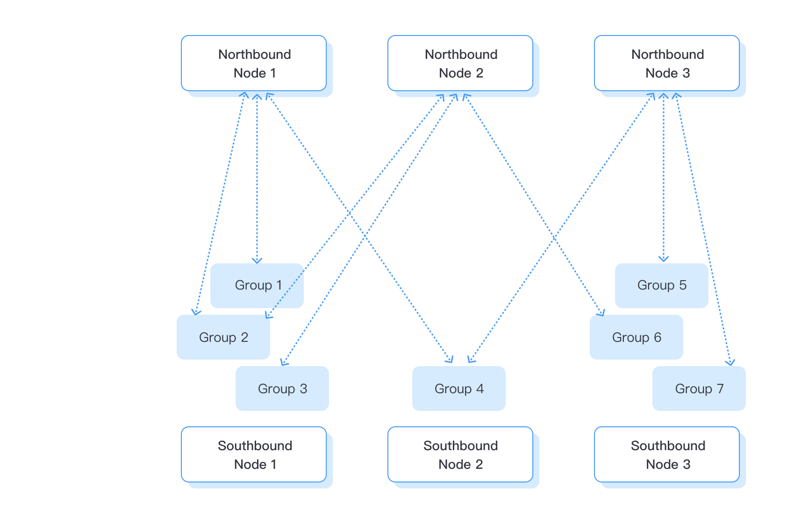

# 数据采集配置

本节旨在介绍如何通过插件在 Neuron 中设置各种工业协议转换，进而完成南向设备的添加。

## 关键概念

### 核心

Neuron 核心框架旨在为各种不同的工业通信协议提供插件构建和应用的基础。这个核心框架包括 NNG 高速总线、数据管理器以控制数据流，以及插件集成的适配器。

### 插件

Neuron 可以分为核心框架和多种可插拔模块。可插拔意味着这些模块可以动态地添加和移除，甚至支持在运行状态下的热插拔。插件可以分为北向应用和南向驱动程序。北向插件通常用于连接到云平台或像处理引擎这样的外部应用程序。南向插件是实现特定协议以访问外部设备的通信驱动程序。为了实现协议格式转换，至少需要一个北向插件和一个南向插件分别用于数据传递和数据采集。

所有这些模块都是用 C 语言编写的，并为那些有兴趣进行二次开发的用户提供 SDK。插件只是由 SDK 构建的动态链接库（.so）文件。具体的插件开发教程请参考 [SKD 教程](../dev-guide/sdk-tutorial/sdk-tutorial.md)。

### 适配器

适配器是为插件数据交换提供两个接口的通信例程：

- NNG 高速总线通信接口，用于和其他适配器交换数据消息。
- 插件接口：用于集成插件模块。

Neuron 提供了两种适配器：

- 驱动程序适配器：用于与南向驱动插件集成。
- 应用程序适配器：用于与北向应用插件集成，与驱动程序适配器在处理数据消息交换时的逻辑不同。

### Node 节点

节点在 Neuron 中被定义为将框架接口与通信例程合并的实体。当一个插件插入核心框架中时，会创建一个连接节点来与外部设备或应用程序通信。在单个运行实例中可能会创建多个节点，用于与各方通信。核心框架负责管理这些节点之间的消息路由。

节点由适配器和插件模块组合而成，节点间的通信基于 NNG 高速消息实现。

该图展示了一个松耦合的设计架构。所有节点独立工作，相互交换数据，并根据其实现的工业协议与外部设备或云进行通信。

### 点位（Tag）

点位是分配给一条信息的非分层唯一关键字，该信息包括设备中的数据存储位置和数据操作属性，用户可以通过识别设备中的特定点位，从设备中读取数据或向设备写入数据。

### 组（Group）

设备中用户感兴趣的点位集合可以分成几个组以便更好地管理。每个组都有独立的轮询频率，用于控制从设备中读取数据时设备轮询的时间间隔。路由机制基于这些组作为信息单元在节点之间进行交换。北向节点可以订阅任何南向节点中的任何组。这些订阅将用于在节点之间路由数据消息。

## 配置流程

以下为如何通过设置 Neuron 进行各种工业协议转换、进而完成数据传递和采集的工作流程。

### 数据采集

1. [**查看可用插件**](../introduction/plugin-list/plugin-list.md)：各种工业插件可以帮助实现 Neuron 的数据采集和传递。只有安装并激活相应插件的许可证后，才能使用特定的驱动插件，具体可查看[许可证政策](../introduction/license/license-policy.md)。由于Neuron 是一个松散耦合的架构，每个插件都作为独立的进程线程运行，不会相互干扰。目前 Neuron 预安装的插件列表如下：
2. [**创建南向驱动**](./south-devices/south-devices.md)：根据工业协议为设备通信选择所有必需的南向插件。根据协议规范，每个南向插件只能与一个设备或关联多个设备的一条消息总线建立连接。用户可选择通过插件或[模版](./templates/templates.md)的方式连接南向设备。
3. [**连接南向设备**](../configuration/groups-tags/groups-tags.md)：通过创建组和点位连接南向设备，创建好组和点位后，即可从数据监控中获取点位的实时值。为方便用户操作，Neuron 支持通过离线 Excel 文件[批量导入](http://localhost:8080/zh/emqx-ecp/latest/config/import-export.html)相关配置信息。

::: tip

重复步骤 2 和 3，直到创建了所有必要的驱动程序、组和点位。
:::

### 数据传递

[**创建北向应用**](./north-apps/north-apps.md)：选择需要的北向插件以实现数据的传送。每个北向插件只能连接到一个目的地，如代理或应用程序。目前 Neuron 支持以下北向应用：

- [eKuiper](./north-apps/ekuiper/overview.md)
- [MQTT](./north-apps/mqtt/overview.md)
- [SparkPlugB](./north-apps/sparkplugb/ignition.md)
- [WebSocket](./north-apps/websocket/websocket.md)
- [Monitor](./north-apps/monitor/overview.md)

[**订阅南向设备**](./subscription/subscription.md)

创建北向设备后，还需订阅组。在此步骤中，不需要设置组和点位。北向节点可以订阅在南向节点中创建的任何组。建立订阅后，相应组的数据将按照组的频率持续发布到北向节点。

### [配置相关 API](../http-api/http-api.md)

Neuron 还提供一组配置 API，用于工业物联网平台、MES 或其他控制系统集成。

