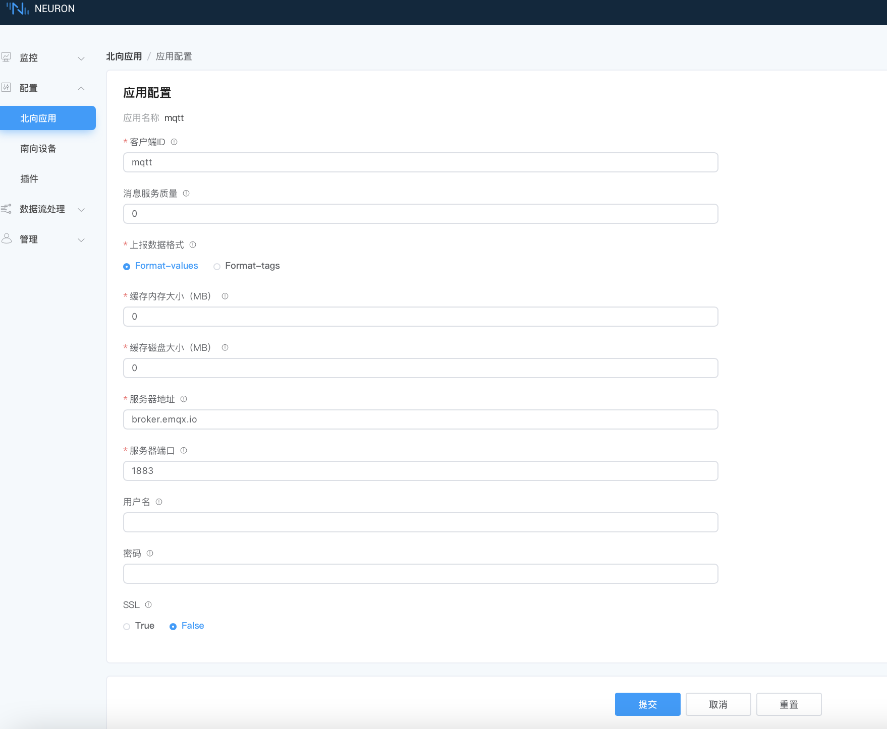

# 概览

[MQTT] 是一种为物联网设备和应用程序设计的消息协议，采用发布与订阅模型，具有轻量、高效、可靠的，支持实时通讯等优点。
MQTT 非常适合资源受限的环境，特别是需要高效使用电力和带宽的场景。

Neuron 支持 MQTT 作为其通讯协议之一。
Neuron MQTT 插件允许用户快速构建使用 MQTT 协议的物联网应用程序，可以在设备和云之间进行通讯。
使用 MQTT 插件，开发人员还可以向 IoT 设备发布消息，触发设备操作，例如打开或关闭灯、电机或者其他设备。
该插件还支持使用身份验证和加密通讯协议进行安全通讯，确保数据的安全性和隐私性。

[MQTT]: https://mqtt.org

## 参数

以下是使用 MQTT 插件配置节点时可用的参数：

| 字段                | 说明                                                         |
| ------------------- | ------------------------------------------------------------ |
| **客户端 ID**       | MQTT 通信的客户端 id，必填。                                 |
| **QoS 等级**        | MQTT 通信的服务质量等级，可选，默认为 QoS 0 。（2.4.0 版新增） |
| **~~upload-topic~~**| ~~订阅数据上报的主题，必填。~~ （2.4.0 版移除）              |
| **上报数据格式**    | 上报数据的 JSON 格式。有 *values-format* 和 *tags-format* 两种格式。在 *values-format* 格式中，数据被分成 `values` 和 `errors` 的子对象。在 *tags-format* 格式中，数据被放在一个数组中。|
| **缓存内存大小**    | 通信失败时内存消息缓存大小 (MB) 限制，必填。范围在 [0, 1024] 。 不能大于 *cache-disk-size* 。|
| **缓存磁盘大小**    | 通信失败时磁盘消息缓存大小 (MB) 限制，必填。范围在 [0, 10240] 。设为非零值时, *cache-mem-size* 也须为非零值。|
| **服务器地址**      | MQTT Broker 地址，必填。                                     |
| **服务器端口**      | MQTT Broker 端口号，必填。                                   |
| **用户名**          | 连接到 Broker 时使用的用户名，选填。                         |
| **密码**            | 连接到 Broker 时使用的密码，选填。                           |
| **SSL**             | 是否启用 SSL，选填，默认不启用。                             |
| **CA 证书**         | CA 证书，启用 SSL 时必填。                                   |
| **客户端证书**      | 客户端证书，使用 SSL 双向认证时必填。                        |
| **客户端私钥**      | 客户端密钥，使用 SSL 双向认证时必填。                        |
| **客户端私钥密码**  | 客户端密钥密码，使用 SSL 双向认证时选填。                    |

### 数据上报

在 Neuron 2.4.0 版本之前， Neuron 的 MQTT 插件将收集到的数据以 JSON 形式发布到由 **upload-topic** 参数指定的主题上。
<figure align="center">
  
  <figcaption align = "center">
    <b>Fig.1 - 在 Neuron 2.3.0 版本中指定上报主题</b>
  </figcaption>
</figure>

Neuron 2.4.0 版本删除了 **upload-topic** 参数， 用户需要通过群组订阅页面指定上报主题。
点击你的 MQTT 节点进入群组订阅页面，然后点击**添加订阅**即可。
<figure align="center">
  
  <figcaption align = "center">
    <b>Fig.2 - 在 Neuron 2.4.0 版本中指定上报主题</b>
  </figcaption>
</figure>

上报数据的确切格式由**上报数据格式**参数控制。
有 **tags-format** 和 **values-format** 两种格式。

更多详细信息，请参阅 [MQTT API](./api.md#data-upload)

### 离线数据缓存

离线数据缓存是 MQTT 插件特有的功能，在网络发生中断时可将数据存储在本地, 当网络连接恢复时，MQTT 插件可以将数据同步到服务器。
这项功能在网络连接不稳定的场景中非常有用，可以增强构建在 Neuron 上的应用程序的鲁棒性和可靠性。

离线数据缓存由**缓存内存大小**和**缓存磁盘大小**参数控制。
**缓存内存大小**参数指定内存缓存大小（单位为兆字节），最大允许缓存大小为 1GB 。
**缓存磁盘大小**参数指定磁盘缓存大小（单位为兆字节），最大允许缓存大小为 10GB 。
当网络中断发生时，MQTT 插件首先将数据存储在内存缓存中，并且仅当内存缓存已满时才将数据刷新到磁盘缓存中。
当网络恢复连接时，MQTT 插件将以 FIFO（先进先出）的顺序将缓存的数据发布到服务器上。

您可以通过将**缓存内存大小**和**缓存磁盘大小**都设置为零来禁用离线数据缓存。

### 数据安全

SSL/TLS（安全套接字层/传输层安全）是一种安全协议，用于加密网络设备之间的通信通道。
它能够在不安全的网络（例如互联网）上使通信变得安全。
MQTT over SSL/TLS 是一种通过 SSL/TLS 加密传输 MQTT 消息的安全方法，用于在客户端和 MQTT 服务器之间传输数据。
这可以确保客户端和服务器之间传递的所有数据都是加密且安全的。

Neuron 的 MQTT 插件支持 MQTT over SSL。要启用 SSL 加密，请在配置节点时打开 **SSL** 参数， 并提供证书授权机构的证书作为 **CA 证书**参数。
要连接到的服务器的证书应由提供的证书授权机构颁发。
如果使用双向身份验证，还应通过**客户端证书**，**客户端私钥**，和**客户端私钥密码**参数分别提供客户端证书，私钥文件，和私钥文件密码。

## MQTT 客户端配置参数

配置 MQTT 客户端相关参数。

点击应用卡片上的 `应用配置` 按键进入应用配置界面设置 MQTT 连接，如下图所示。

* 客户端 ID：注意每个 ID 要相互独立，不可以重复，使用默认值 mqtt；
* 服务质量等级：选择0，1，2。
* 服务器地址：使用默认的公共的 EMQX Broker（broker.emqx.io）；
* 服务器端口：使用 MQTT broker port（1883）；
* 点击`提交`，完成北向应用的配置，应用卡片自动进入 **运行中** 的工作状态。

## 使用 MQTTX 查看数据

订阅完成后，用户可以使用 MQTT 客户端（推荐使用 MQTTX，可在[官网](https://www.emqx.com/zh/products/mqttx)中下载）连接到公共的 EMQX 代理来查看上报的数据，如下图所示。

在 MQTTX 中订阅对应的 Topic 后，可看到此 Topic 中能持续收到由 Neuron 上报的数据。

* 打开 MQTTX 添加新的连接，正确填写名称与公共 EMQX Broker 的 Host 与 Port（默认为 broker.emqx.io，1883），完成连接;
* 添加新的订阅，Topic 要与设置北向应用参数中的 Upload topic 保持一致，例如，填写 `/neuron/mqtt/upload`。

:::tip
默认的上传 Topic 的主题格式为 `/neuron/{node_name}/upload`，其中 {node_name} 为创建的北向应用的名称。用户也可自定义上报主题。
:::
