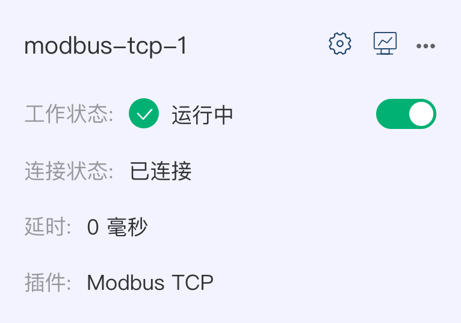

# 连接南向设备

## 第一步，添加南向设备

创建南向设备节点，用于连接到真实设备或模拟器。

在 **配置 -> 南向设备管理**，点击 `添加设备` 来创建设备节点，添加一个新的南向设备：

* 名称：此设备名称，例如 modbus-tcp-1；
* 插件：选择 modbus-tcp 插件。

## 第二步，设置南向设备参数

配置 Neuron 与设备建立连接所需的参数。在右上角可以选择列表或卡片展示南向设备。

点击南向设备卡片上的 `设备配置` 进入设备配置界面:

* 设备 IP 地址：填写安装 PeakHMI Slave Simulators 软件的 PC 端 IP 地址；
* 设备端口：填写 modbus 模拟器所使用的端口，默认使用 502 端口；
* 接收超时时间：单位 ms，默认为 3,000，超过设置时间未接收到消息则报错。
* 点击 `提交`，完成设备配置，设备卡片自动进入 **运行中** 的工作状态。

:::tip
每个设备所需的配置参数有所不同，详细南向设备参数说明可参考 [南向驱动](../south-devices/modbus-tcp/modbus-tcp.md)。
:::

南向设备/北向应用创建成功后，南向/北向管理界面会出现新创建的卡片，如下图所示。

该设备卡包含以下信息：

* 名称：用户为南向设备/北向应用提供的唯一名称。设置后，名称暂时不能修改。
* 设备/应用配置：点击该按钮进入配置界面，用于设置Neuron连接南向设备/北向应用所需的参数设置。
* 数据统计：统计节点卡片信息。
* 更多
    * DEBUG 日志：打印节点调试日志，打印节点调试日志，用户可通过该选项打印该节点的 Debug 级别日志，十分钟后恢复打印默认日志级别。
    * 删除：从南向设备列表中删除该节点。
* 状态：显示设备节点的当前状态，目前节点分为五种工作状态：
    * **初始化**：首次添加南向设备/北向应用卡后，将进入初始化状态。
    * **配置中**：进入设备/应用程序配置，并进入配置状态。
    * **就绪**：配置成功后，进入就绪状态。
    * **运行中**：运行设备卡片。
    * **停止**：停止设备卡片。
* 工作状态切换按钮：是否打开与设备的连接。
    * 打开：Neuron与设备/应用建立连接，开始收集数据。
    * 关闭：断开设备连接，停止收集数据。
* 连接状态：显示设备的连接状态。
    :::tip
    添加组和标签后，Neuron会连接设备采集数据，连接状态会显示**已连接**。
    :::
* 延迟时间：发送和接收指令之间的时间间隔。
* 插件：用于显示该设备使用的插件模块的名称。
