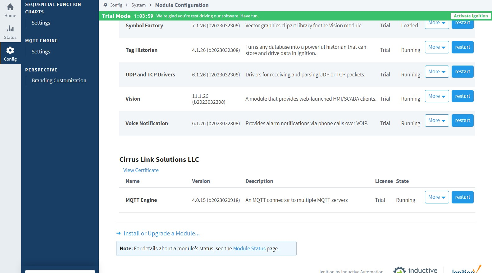
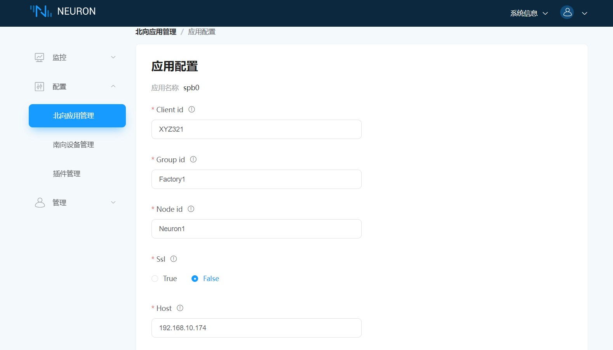
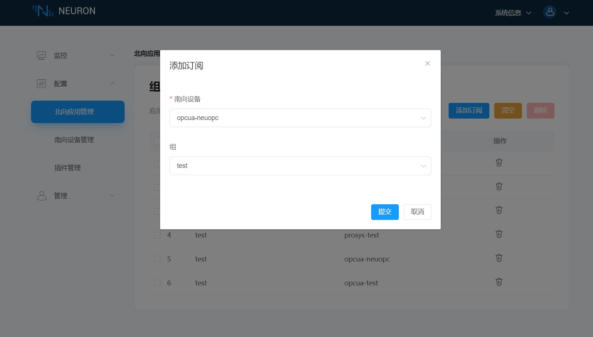
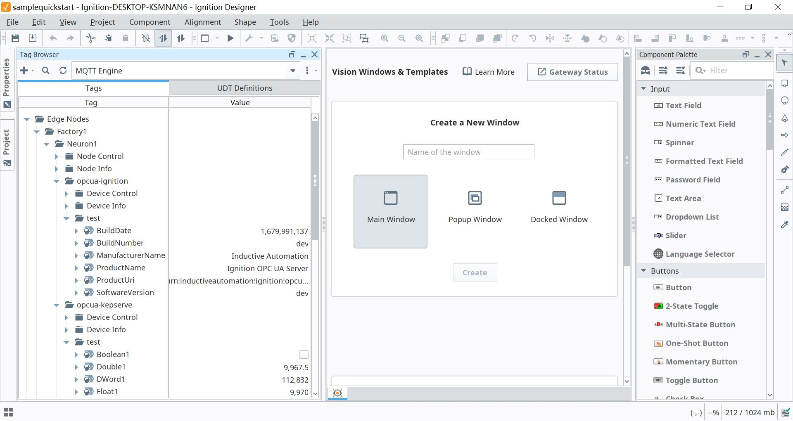

# 连接 Ignition

## 安装 Ignition

1. 从 Ignition 官网下载 Ignition 安装包，按照官方文档进行安装。

2. 从 Ignition 官网下载 Designer Launcher 安装包，按照官方文档进行安装。

3. 从 Ignition 官网下载第三方模块 MQTT-Engine-signed.modl。登录 Ignition web 管理页面，进入 **Config** -> **Modules** 页面，点击 `Install or Upgrade a Module...`，安装 `MQTT-Engine-signed`。

4. 本机启动一个 EMQX broker 实例，启动命令：`./bin/emqx start`。

5. 打开 **Config** -> **MQTT ENGINE/Setting** -> **Servers** -> **Setting**，点击 `Create new MQTT Server Setting...` 创建一个 `Name` 为 EMQX 的连接，`URL` 设置为 `tcp:://localhost:1883`，点击 `Save Changes` 保存设置。

## Neuron 设置

1. 在 Neuron **北向应用管理** 中添加一个 Sparkplug B 应用。

2. 在 **应用配置** 中填写 `客户端 ID`、`组 ID`、`节点 ID`、`服务器地址` 和 `服务器端口`, 点击 `提交` 并启动连接。

3. 在 **组列表** 中添需要订阅的 `南向设备` 和 `组`。

## Ignition Designer 设置

1. 打开 Desiger Launcher 桌面图标，点击 `Add Designer` 添加安装好的 Ignition 服务器 URL。

2. 连接到 Ignition 服务器后，打开 `samplequickstart`。

3. 在软件界面中找到 **Tag Browser** 并选择 `MQTT Engine`，展开 `Edge Nodes\Factory1\Neuron1\opcua-kepserver\test` 可以看到即时上传的测点数据。
