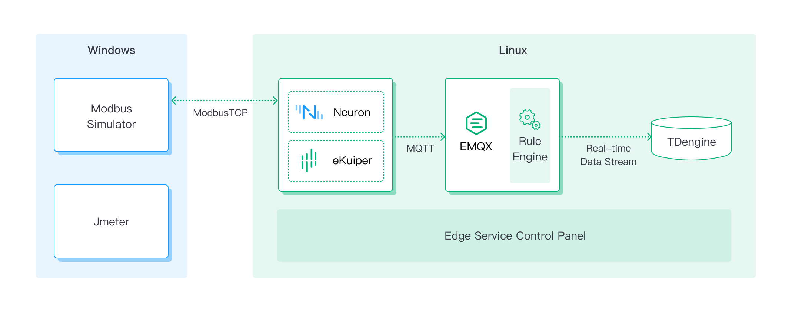

# 性能测试

性能验证包括Neuron数据采集性能测试、Neuron数据下发性能测试及采集数据点位存储性能测试等；在测试过程中同步进行功能验证，包括规则引擎、边缘计算及云边协同监控等功能；在测试过程中持续监控设备连接数，连接稳定性，消息的成功率，CPU，网络IO，内存情况等，详细测试场景如下。

## 测试场景

根据客户实际需求，规划了以下测试场景：

1. Neuron数据采集测试一

| 模拟设备数量 | 每个设备数据点数量 | 采集频率 | 总计数据点位 |
| ------------ | --------- | ---------- | --------- | 
| 500 | 30 | 1s | 15000 |

Neuron通过ModbusTCP协议，模拟连接500台设备，每台设备采集 30个数据点，采集频率为1秒一次，总计Neuron每秒采集15000个数据点位。

2. Neuron数据采集测试二
 
| 模拟设备数量 | 每个设备数据点数量 | 采集频率 | 总计数据点位 |
| ------------ | --------- | ---------- | --------- | 
| 500 | 30 | 0.5s | 15000 |

Neuron通过ModbusTCP协议，模拟连接500台设备，每台设备采集 30个数据点，采集频率为0.5秒一次，总计Neuron每0.5秒采集15000个数据点位。

3. Neuron数据下发测试一
 
| 设备数量 | 单设备下发数据点数 | 总计下发数据点数 | 下发方式 |
| ------------ | --------- | ---------- | --------- | 
| 1 | 50 | 50 | Neuron API |

Neuron通过ModbusTCP协议，模拟连接1台设备，通过Neuron API接口向设备写入50个数据点，测试完成数据下发总计时间。

4. Neuron数据下发测试二
 
| 设备数量 | 单设备下发数据点数 | 总计下发数据点数 | 下发方式 |
| ------------ | --------- | ---------- | --------- | 
| 1 | 50 | 200 | Neuron API |

Neuron通过ModbusTCP协议，模拟连接4台设备，通过Neuron API接口向设备总计写入200个数据点，测试完成数据下发总计时间。

5. Neuron采集数据批量写入涛思数据测试

模拟Neuron采集100个设备的数据，每个设备包含 100个数据点位，每秒上报共10000个数据点位到EMQX 企业版，通过EMQX内置规则引擎将以上数据实时写入涛思数据库。

## 测试架构

1. 测试资源

Modbus模拟器模拟现场PLC设备，Neuron通过Modbus TCP连接模拟器，Neuron采集到数据后通过MQTT协议发送至EMQX企业版，数据通过EMQX内置规则引擎写入涛思数据库。

所使用Neuron EMQ X企业版、Modbus模拟器资源如下：

服务1: 笔记本电脑
* Modbus模拟器
* Jmeter软件

服务2: Linux服务器 4C/16G
* Neuron V2.2.1
* EMQX 企业版
* Tdengine数据库
* 云边协同管理软件

2. 测试架构图

3. 测试工具介绍

<b>Modbus模拟器</b>

[PeakHMI Modbus TCP slave simulator](https://www.hmisys.com)，是一款功能齐全、性能优秀的Modbus模拟器。

<b>性能测试工具Jmeter</b>

性能测试工具Jmeter是一款基于Java的压力测试工具。它可以用于对服务器、网络或对象模拟繁重的负载来测试它们的强度或分析不同压力类型下的整体性能。

## 测试结论及报告

1. Neuron数据采集测试一

Neuron通过ModbusTCP协议，模拟连接500台设备，每台设备采集 30个数据点，采集频率为1秒一次，总计Neuron每秒采集15000个数据点位。
* Neuron采集程序CPU使用率约为124.3%，内存使用率约为0.6%
* 服务器资源CPU空闲在55%左右，内存空闲在9.8G左右。
 
 

2. Neuron数据采集测试二

Neuron通过ModbusTCP协议，模拟连接500台设备，每台设备采集 30个数据点，采集频率为0.5秒一次，总计Neuron每0.5秒采集15000个数据点位。
* Neuron采集程序CPU使用率约为111.3%，内存使用率约为1.1%
* 服务器资源CPU空闲在35%左右，内存空闲在9.5G左右。

 
3. Neuron数据下发测试一

Neuron通过ModbusTCP协议，模拟连接1台设备，通过Neuron API接口向设备写入50个数据点，测试完成数据下发总计时间。
Neuron对1个设备下发50个数据点位，最大响应时间159毫秒，最小响应时间3毫秒，平均响应时间91毫秒，总计耗时159毫秒。
 

4. Neuron数据下发测试二

Neuron通过ModbusTCP协议，模拟连接4台设备，通过Neuron API接口向设备总计写入200个数据点，测试完成数据下发总计时间。
Neuron对4个设备下发共计200个数据点位，最大响应时间107毫秒，最小响应时间3毫秒，平均响应时间52毫秒，，总计耗时107毫秒。

5. Neuron采集数据批量写入涛思数据测试

模拟Neuron采集100个设备的数据，每个设备包含 100个数据点位，每秒上报共10000个数据点位到EMQX 企业版，通过EMQX内置规则引擎将以上数据实时写入涛思数据库。
* EMQX软件CPU使用率约为91.2%，内存使用率约为1.2%
* 服务器资源CPU空闲在13%左右，内存空闲在156M左右。

	 

